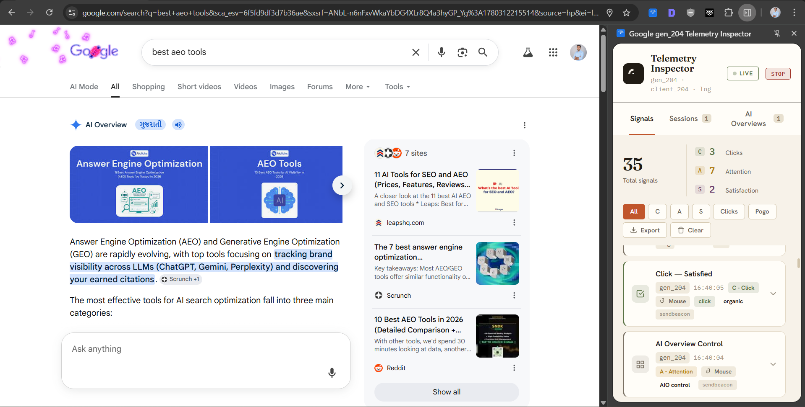

# Google gen_204 Telemetry Inspector

A Chrome extension that captures and decodes Google's `/gen_204` SERP telemetry in real time, so you can see, signal by signal, how Google measures your behaviour on a search results page.

Every time you search, scroll, hover, click, or hit the back button on Google, your browser quietly fires small tracking pings to endpoints like `/gen_204`, `/client_204`, and `/log`. This extension intercepts those pings, decodes their cryptic parameters into plain English, and classifies each one against Google's internal CAS model (Clicks, Attention, Satisfaction).

> This tool is an implementation of public reverse-engineering research by two authors. All credit for the underlying analysis belongs to them. See [Credits and research](#credits-and-research).

## Table of contents

- [Screenshot](#screenshot)
- [Features](#features)
- [How it works](#how-it-works)
- [Decoded parameters](#decoded-parameters)
- [Installation](#installation)
- [Usage](#usage)
- [Why this matters](#why-this-matters)
- [Credits and research](#credits-and-research)
- [Disclaimer](#disclaimer)

## Screenshot



Live capture on a `best seo tools` query. Attention, SERP Heartbeat, and raw telemetry signals stream in alongside the AI Overview, with running CAS counts (4 Clicks, 16 Attention, 2 Satisfaction, 70 total).

## Features

- **Live capture.** Pings appear in the popup the instant they fire, with no page reload.
- **CAS classification.** Every signal is tagged as C (Click), A (Attention), or S (Satisfaction), the three pillars Google Research uses to judge result quality.
- **Full parameter decoding.** Around 40 telemetry parameters translated from codes like `ct=slh` into readable labels such as "Organic Click (Search Link Hit)".
- **Interaction-mode detection.** Badges each event as Mouse, Keyboard (including accessibility tab navigation), or Gesture/Touch.
- **AI-surface awareness.** Separately recognises AI Overview (`aio=1`, `fid=18`) and AI Mode (`fid=268`) telemetry.
- **Smart categorisation.** Colour-coded event types: Organic Click, Pogo-Stick Return, Attention Signal, Viewport, Performance, SERP Heartbeat, and more.
- **Filtering.** One-tap filters by CAS pillar or by signal category.
- **Live stats.** Running counts of Click, Attention, and Satisfaction signals.
- **JSON export.** Dump the full captured event log for offline analysis.
- **Local-only.** Everything stays in `chrome.storage.local`. Nothing is sent anywhere.

## How it works

The extension is a small, dependency-free Manifest V3 build. Capturing telemetry that the page itself generates requires a two-world approach, because content scripts run in an isolated JavaScript world and cannot see the page's `fetch` and `XHR` calls directly.

```
+----------------------- google.com tab -----------------------+
|                                                              |
|   PAGE WORLD                       ISOLATED WORLD            |
|  +--------------+   __serp_ping__  +--------------+          |
|  | injector.js  | ---CustomEvent-> |  content.js  |          |
|  |              |                  |              |          |
|  | wraps:       |                  | decode() +   |          |
|  | - fetch      |                  | categorize() |          |
|  | - XHR.open   |                  | + CAS tag    |          |
|  | - sendBeacon |                  +------+-------+          |
|  | - img.src    |                         |                  |
|  +--------------+                         v                  |
|                                 chrome.storage.local         |
+-------------------------------------------+------------------+
                                            | polled every 800ms
                                            v
                                  +------------------+
                                  |  popup.html/js   |
                                  |  live dashboard  |
                                  +------------------+
```

1. **`content.js`** (isolated world) runs at `document_start` and injects `injector.js` into the page through a `<script src>` tag, a CSP-safe way to reach the page's JavaScript world.
2. **`injector.js`** (page world) wraps the four ways Google fires a telemetry ping: `fetch`, `XMLHttpRequest.open`, `navigator.sendBeacon`, and `.src` (1x1 pixel pings). When a request matches a telemetry endpoint, it parses the URL parameters and dispatches a `__serp_ping__` `CustomEvent`. The original network call still proceeds untouched, so nothing is blocked or modified.
3. **`content.js`** listens for `__serp_ping__`, then it:
   - decodes each parameter using a key-label and value-label dictionary,
   - categorises the event (Organic Click, Pogo, AI Overview, and so on) for the icon and colour,
   - tags the CAS dimension (C, A, or S),
   - detects interaction mode (mouse, keyboard, or gesture),
   - and persists the enriched event to `chrome.storage.local`, capped at the most recent 500.
4. **`popup.js`** polls storage every 800 ms and renders the live, filterable dashboard.

## Decoded parameters

| Parameter | Meaning |
|-----------|---------|
| `ct` | Click or event type: `slh` (search link hit), `backbutton`, `srpf`, `psnt`, `fa`, `ejsa` |
| `me` | Measurement event, a behavioural payload. Sub-codes decoded: `R` geometry, `G` gesture, `S` scroll, `V` viewport, `h` hover, `i` in-view, `o` out-of-view, `74` tap |
| `pv` | Page-view or element visibility, the CAS attention signal |
| `im`, `m` | Interaction mode: M mouse, V keyboard, G gesture |
| `tni`, `atni` | Tab and active-tab navigation index (keyboard accessibility) |
| `trs` | Time away from SERP before returning (pogo dwell) |
| `st` | Session or element time before the ping |
| `opi` | Operation ID, the anchor Google uses to measure pogo-sticking |
| `aqid`, `ei` | Active query ID and event identifier |
| `fid` | Feature ID: `18` AI Overview, `268` AI Mode, others SERP features |
| `aio` | AI Overview rendered (`=1`) |
| `s`, `astyp`, `aimq`, `folid` | AI Mode surface, async event type, query ID, follow-up container |
| `ved`, `vet`, `vwd` | Visual element data, token, and encoded payload |
| `uact` | User action type (UI feature interactions) |
| `nt` | Navigation type: `navigate`, `reload` (re-render), `expansion` |
| `inp`, `lcp`, `fcp`, `cls`, `dcl`, `aft` | Core Web Vitals and page-health timing |
| `zx` | Unix timestamp (ms) |
| `v`, `bb`, `bl`, `hl`, `fmt`, `jsbp`, `msc`, `gwsrpc` | Format version, build variant and label, language, format, JS protobuf, module and RPC plumbing |

## Installation

Works in Chrome, Edge, and Brave.

1. Download or clone this folder.
2. Go to `chrome://extensions/`.
3. Enable Developer Mode (top-right toggle).
4. Click Load unpacked and select the `gen204-inspector` folder.
5. The blue signal icon appears in your toolbar. Pin it for quick access.

## Usage

1. Click the toolbar icon to open the inspector.
2. In another tab, search on google.com, then click results, press back, hover, scroll, and interact with AI Overviews and AI Mode.
3. Watch signals stream in. Filter by C, A, or S to study each CAS pillar, or by category (Clicks, Pogo, AIO, Keyboard, Gesture, Perf, and so on).
4. Click any event to expand its decoded signals and raw parameters.
5. Click Export to save the full log as JSON for offline analysis.

## Why this matters

The two articles below, cross-referenced with DOJ-trial testimony from Google's Pandu Nayak, point to one conclusion: raw `/gen_204` interaction data is critical fuel for Google's ranking models. It trains Navboost (a click-memory system) and seeds RankBrain (originally around 13 months of click and query data) and RankEmbed BERT, which are then fine-tuned on human Information Satisfaction (IS) ratings.

The practical reframing for SEO:

- A click is not the goal. A good click (long dwell, no return) is. A bad click (fast pogo-stick back to the SERP) is a negative signal.
- Good abandonment is real. A zero-click answer where the user leaves satisfied (for example, "capital of Poland") counts as success in the CAS and IS4@5 framework, even with zero CTR.
- Attention precedes the click. Visibility (`pv`), hover dwell, and scroll are measured before any click happens. Earning attention is its own optimisation target.
- Reduce the need to return. Time-away (`trs`) plus a back-button event is the clearest dissatisfaction fingerprint Google can log.

So the lever is not "rank higher, get clicks." It is "earn attention, satisfy intent, suppress the return-to-SERP." This inspector lets you watch all three on your own queries.

## Credits and research

This extension is an implementation of insight that belongs to the researchers below. Please read their original work; it is the real value here.

- **Vijay Chauhan**, "Google Is Not Just Counting Clicks. It May Be Measuring the Whole Search Journey."
  https://vijaychauhanseo.substack.com/p/google-is-not-just-counting-clicks
- **Przemek (Seekio.pl)**, "The Multidimensional Role of Clicks in Evaluation and Ranking."
  https://seekio.pl/the-multidimensional-role-of-clicks-in-evaluation-and-ranking/

The CAS model, the `/gen_204` parameter interpretations, the Navboost, RankBrain, and IS4@5 framing, and the good-click and good-abandonment concepts all come from their analysis. This tool just makes those signals visible in your own browser.

## Disclaimer

This is a research and educational tool. It only reads telemetry your own browser already sends to Google. It blocks nothing and transmits nothing externally. Parameter meanings are well-reasoned interpretations from public research, patents, and trial exhibits, not official Google documentation. None of these are confirmed direct ranking factors.

---

Made with love by [Sukhdev Miyatra](https://www.linkedin.com/in/sukhdevmiyatra/)
